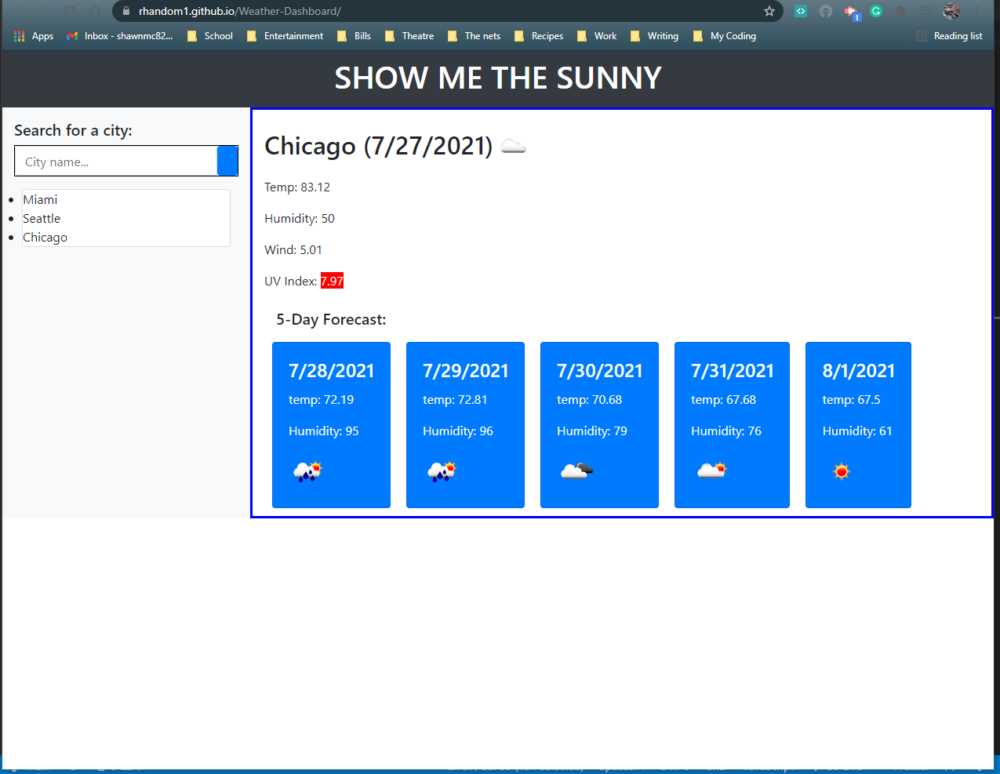

# 06 Server-Side APIs: Weather Dashboard

## Purpose

The purpose of this project was to creat a working application from scratch, utilizing the OpenWeather API. Framework and scripting where left to our choices. This particular app uses Bootstrap and Jquery for a majority of the coding.

### Acceptance Criteria

```
GIVEN a weather dashboard with form inputs
WHEN I search for a city
THEN I am presented with current and future conditions for that city and that city is added to the search history
WHEN I view current weather conditions for that city
THEN I am presented with the city name, the date, an icon representation of weather conditions, the temperature, the humidity, the wind speed, and the UV index
WHEN I view the UV index
THEN I am presented with a color that indicates whether the conditions are favorable, moderate, or severe
WHEN I view future weather conditions for that city
THEN I am presented with a 5-day forecast that displays the date, an icon representation of weather conditions, the temperature, and the humidity
WHEN I click on a city in the search history
THEN I am again presented with current and future conditions for that city
```

#### Screenshots and links


https://rhandom1.github.io/Weather-Dashboard/
https://github.com/Rhandom1/Weather-Dashboard